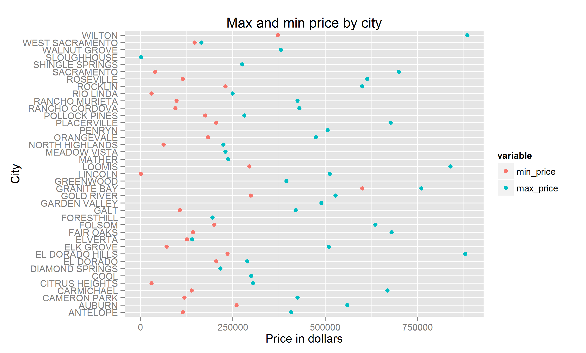
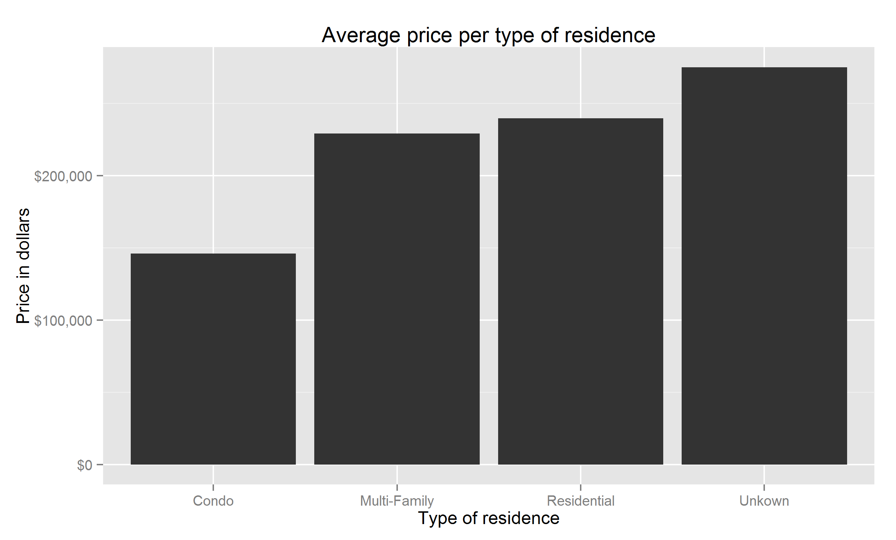
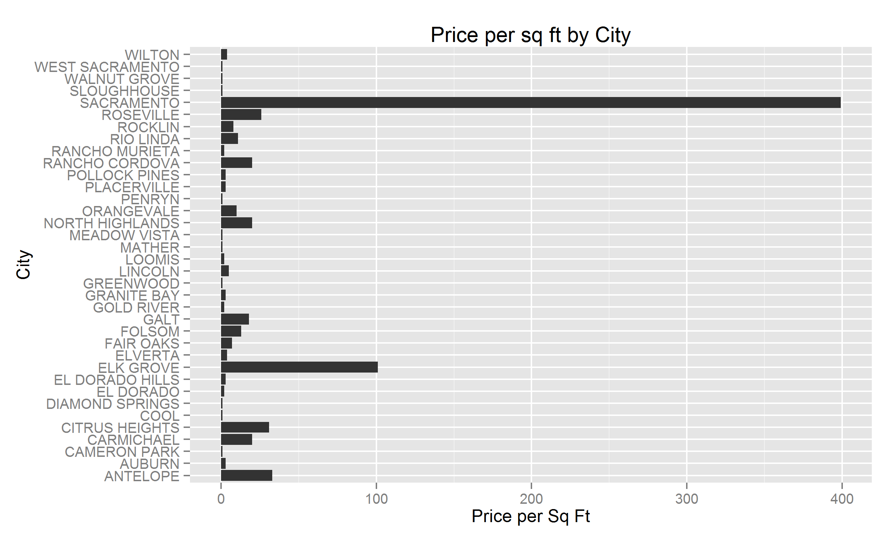

Project 2 Guidelines:
```
1. Create a GitHub Repository named DV_RProject2 (you only need one per project team). Register your Project URL using the "Register Your Project" link on the class website.

2. Clone the project into a DV_RProject2 folder in your Data Visualization Folder, all of the project code should go into this repository.

3. Create an RStudio DV_RProject2 Project (this is where you will do your development)

4. The repository should have the following structure:
  00 Doc
  01 Data
  02 Data Wrangling
  03 Visualizations - this might not be needed if all your visualizations are in workflows in the 02 Data Wrangling folder.

5. Using KnitR, build an html file that documents the steps to reproduce your project . Use this html file to present a visual story about your data and what you discovered about your data using visualization techniques.

6. Find a data set (csv file) that you are interested in that is of a "natural science' or "business" orientation or is associated with the major you are studying. The data set should be a few thousand rows in the csv file.

7. Register your data set type (e.g., census data) under the PROJECT_2_DATA column using the "Register Your Project" link on the class website. I WANT EACH PROJECT TO HAVE A DIFFERENT DATA SET TYPE. So, don't use a data set type that's already been registered. Yes, this is first-come, first-served.

8. Load the csv file into Oracle as demonstrated in class on Feb 5th.

9. Modify the following query by changing the SQL statement and filling in your UTEid to build a data frame from your data:

df <- data.frame(eval(parse(text=substring(getURL(URLencode('http://129.152.144.84:5001/rest/native/?query="select * from emp"'), httpheader=c(DB='jdbc:oracle:thin:@129.152.144.84:1521:ORCL', USER='C##cs329e_UTEid', PASS='orcl_UTEid', MODE='native_mode', MODEL='model', returnFor = 'R', returnDimensions = 'False'), verbose = TRUE), 1, 2^31-1))))

10. Display an appropriate subset of this data frame in your KnitR document.

11. Describe at least 3 interesting data wrangling sets of operations using %>% in each. There should be a group_by in at least one of them.

12. Produce some interesting visualizations of your wrangled data set.
```
```{r}
source("../Rprofile.R", echo = FALSE) #load libraries
```

```{r}
source("../01 Data/Dataframe.R", echo = TRUE) #load dataframe
tbl_df(df)
```

```{r}
source("../02 Data Wrangling/average_price.R", echo = TRUE)
y
```
```
y1 <- melt (y, id.vars="CITY", measure.vars=c("min_price","max_price"))

ggplot (y1, aes(x=CITY, y=value, color=variable)) + geom_point() + coord_flip()+ xlab("City") + ylab("Price in dollars") + ggtitle("Max and min price by city")
```


```{r}
source("../02 Data Wrangling/group_by_type.R", echo = TRUE)
z
```
```
library(scales)
od <- ggplot (z, aes(x=TYPE, y=average_price)) + geom_bar(stat="identity") + scale_y_continuous(labels=dollar) + xlab("Type of residence")+ylab("Price in dollars")+ggtitle("Average price per type of residence")
ggsave(file="type_price.png", path="00 Doc")
```


```{r}
source("../02 Data Wrangling/price_per_sqft.R", echo = TRUE)
x
```
```
ggplot (x, aes(x=CITY)) + geom_bar (stat="bin") + coord_flip() + xlab("City") + ylab("Price per Sq Ft") + ggtitle("Price per sq ft by City")
ggsave(file="price_city.png", path="00 Doc")
```
